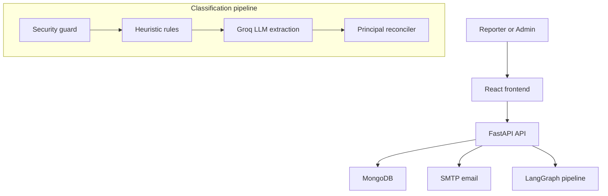
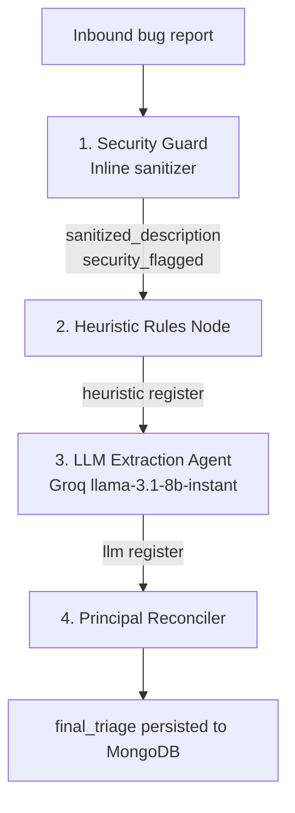
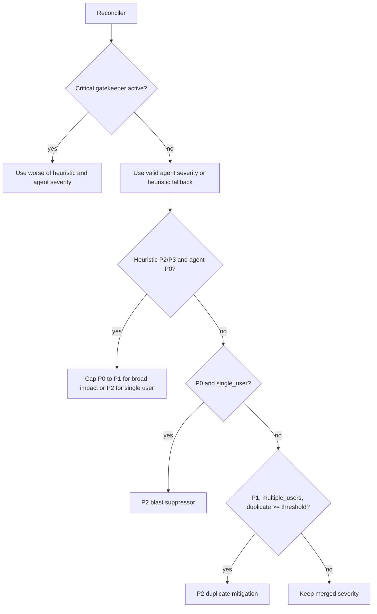

# BugTriage AI

AI-powered bug reporting and operations triage. The app combines a JWT-protected report form, a separate protected admin console, MongoDB persistence, email OTP MFA, deterministic heuristics, Groq LLM enrichment, duplicate scoring, and a reconciler that produces an auditable final triage decision.

## What It Does

- Accepts authenticated bug reports with title, description, reporter email, and optional screenshot URLs.
- Sanitizes prompt-injection style text before classification.
- Applies deterministic heuristic rules for severity, component, and critical gatekeeping.
- Calls Groq for summary, blast radius, assignee group, and advisory severity.
- Computes duplicate likelihood against recent tickets stored in MongoDB.
- Reconciles heuristic and LLM signals into final severity, routing action, tags, and assignee group.
- Provides an admin dashboard for ticket search, detail review, KPI cards, and status transitions.
- Uses email OTP MFA for report-panel sign-in; admin sign-in is email and password only.

## Tech Stack

| Area | Technology |
|------|------------|
| Backend | FastAPI, LangGraph, Pydantic, Motor |
| Database | MongoDB |
| AI enrichment | Groq chat completions API |
| Auth | Email/password, OTP challenge, JWT bearer token |
| Email | SMTP via `aiosmtplib` |
| Frontend | React 19, TanStack Start, Vite, Tailwind CSS |
| Deployment | Docker Compose, Vite frontend container for localhost use |

## Requirements Compliance

| Area | Status | Implementation |
|------|--------|----------------|
| Auth, OTP, and JWT | Met | Register/sign-in/OTP verification, admin token flow, and role-aware `/auth/me` endpoints. |
| LangGraph classification | Met | Security guard, heuristic rules, Groq enrichment, duplicate scoring, and reconciler nodes. |
| MongoDB persistence | Met | Motor-backed users, OTP challenges, ticket storage, indexes, and default admin seed. |
| Frontend panels | Met | Protected viewer report panel, protected admin dashboard, ticket detail view, KPI cards, and status controls. |
| Docker deliverables | Met | Root `docker-compose.yml`, FastAPI backend container, MongoDB, and Nginx frontend container. |
| KPI endpoints | Met | Volume, severity, and SLA endpoints under `/kpis`. |
| Seed data and tests | Met | 30-ticket seed script plus tests for auth/OTP, mocked classification, and KPI aggregation. |

## Quick Start With Docker

1. Copy the environment template:

```bash
cp .env.example .env
```

2. Edit `.env` and set at least:

```env
SECRET_KEY=replace-with-a-32-plus-character-secret
GROQ_API_KEY=replace-with-your-groq-api-key
```

3. Start the stack:

```bash
docker compose up --build
```

4. Open the app:

| Service | URL |
|---------|-----|
| Frontend | http://localhost:3000 |
| Report form | http://localhost:3000/report |
| Admin console | http://localhost:3000/admin |
| API docs | http://localhost:8000/docs |
| MongoDB | mongodb://localhost:27017 |

The Docker setup reads the root `.env`, starts MongoDB, builds the FastAPI backend, and runs the Vite frontend server for localhost use.
The backend image creates its own virtual environment at `/opt/venv` and runs the API from that environment.

If the default ports are already in use, override the host ports before starting Compose:

```cmd
set MONGODB_HOST_PORT=27018
set API_HOST_PORT=8002
set FRONTEND_HOST_PORT=3001
set DOCKER_PUBLIC_API_BASE=http://localhost:8002
set DOCKER_APP_PUBLIC_URL=http://localhost:3001
set DOCKER_CORS_ORIGINS=http://localhost:3001,http://127.0.0.1:3001
docker compose up --build -d
```

With these overrides, connect MongoDB Compass to `mongodb://localhost:27018/triage`.

### Admin sign-in

| Field | Default |
|-------|---------|
| URL | http://localhost:3000/admin |
| Email | `admin@example.com` |
| Password | `change-me-admin-password` |

Override with `ADMIN_EMAIL` and `ADMIN_PASSWORD` in `.env`. No OTP is required for admin sign-in.

## Local Development

Requirements:

- Python 3.10+
- MongoDB running locally
- A Groq API key

Create the root `.env`:

```bash
cp .env.example .env
```

Set these local values:

```env
SECRET_KEY=replace-with-a-32-plus-character-secret
GROQ_API_KEY=replace-with-your-groq-api-key
MONGODB_URL=mongodb://localhost:27017
PUBLIC_API_BASE=http://127.0.0.1:8000
APP_PUBLIC_URL=http://localhost:5173
VITE_API_BASE_URL=http://127.0.0.1:8000
CORS_ORIGINS=http://localhost:5173,http://127.0.0.1:5173
```

Run the backend:

```bash
python -m venv .venv
./.venv/Scripts/python -m pip install -r backend/requirements.txt
cd backend
../.venv/Scripts/python -m uvicorn app.main:app --reload --port 8000
```

Seed sample tickets for dashboard/KPI testing:

```bash
cd backend
python -m app.db.ticket_seed
```

The seed script replaces its previous seeded batch and inserts 30 sample bug reports across P0-P3 severities.

Run backend tests from the project root:

```bash
pytest backend/tests
```

Run the frontend in a second terminal:

```bash
cd frontend
npm ci
npm run dev
```

Open:

- App: http://localhost:5173
- Report form: http://localhost:5173/report
- Admin console: http://localhost:5173/admin
- API docs: http://127.0.0.1:8000/docs

## Configuration

Environment variables are loaded from the root `.env` file.

| Variable | Required | Description |
|----------|----------|-------------|
| `SECRET_KEY` | Yes | JWT signing secret. Must be at least 32 characters. |
| `GROQ_API_KEY` | Yes | Required for bug classification. The app does not use mock LLM output. |
| `GROQ_MODEL` | No | Groq model name. Default: `llama-3.1-8b-instant`. |
| `MONGODB_URL` | No | MongoDB connection string. Docker overrides this to `mongodb://mongodb:27017`. |
| `MONGODB_DB` | No | MongoDB database name. Default: `triage`. |
| `SMTP_HOST` | No | SMTP host for OTP and notification emails. |
| `SMTP_PORT` | No | SMTP port. Default: `587`. |
| `SMTP_USER` | No | SMTP username. |
| `SMTP_PASSWORD` | No | SMTP password. |
| `SMTP_FROM` | No | Sender address for app emails. |
| `SMTP_START_TLS` | No | Enable STARTTLS, usually `true` for port `587`. |
| `SMTP_TLS` | No | Enable implicit TLS, usually `true` for port `465`. |
| `DEV_LOG_OTP` | No | Legacy setting retained for configuration compatibility; OTPs are never displayed in the frontend. |
| `OTP_EXPIRE_MINUTES` | No | OTP challenge lifetime. Default: `10`. |
| `JWT_EXPIRE_MINUTES` | No | Admin JWT lifetime. Default: `60`. |
| `CORS_ORIGINS` | No | Comma-separated frontend origins allowed by the API. |
| `PUBLIC_API_BASE` | No | Public API base URL used for links and frontend config. |
| `APP_PUBLIC_URL` | No | Public frontend URL used in app links. |
| `DUPLICATE_LIKELIHOOD_THRESHOLD` | No | Duplicate mitigation threshold. Default: `0.92`. |
| `ALLOW_PUBLIC_REGISTER` | No | Allow self-service signup as `viewer`. Default: `true`. |
| `ADMIN_EMAIL` | No | Seeded administrator email. Default: `admin@example.com`. |
| `ADMIN_PASSWORD` | No | Seeded administrator password. Default: `change-me-admin-password`. Change in production. |

Generate a local secret with:

```bash
python -c "import secrets; print(secrets.token_urlsafe(48))"
```

## Frontend Configuration

The Vite frontend loads `VITE_API_BASE_URL` from the root `.env` file. For local development, set it to the running API:

```env
VITE_API_BASE_URL=http://127.0.0.1:8000
```

In Docker, the frontend is served at `http://localhost:3000` and the API is exposed at `http://localhost:8000`.

## Architecture



### Agentic Pipeline

Inbound bug reports always move through four isolated nodes. Each node reads the shared graph state and writes its own envelope. Malicious input does not abort the workflow; the Security Guard neutralizes prompt-injection text and downstream nodes receive `sanitized_description`.



Pipeline stages:

1. Security guard strips prompt-injection style instructions and stores whether the report was flagged.
2. Heuristic rules assign baseline severity, component, tags, confidence, and critical gatekeeper state.
3. Groq LLM extraction enriches the ticket with one-line summary, blast radius, assignee group, and advisory severity.
4. Duplicate scoring compares the new report to recent tickets in MongoDB.
5. Reconciler applies policy rules and writes final triage output.

### Security Guard

The Security Guard scans title and description for override phrases such as `ignore rules`, `ignore previous instructions`, `set to P0`, `override system rules`, `admin override`, and `system:`. When a match is found, hostile text is stripped and whitespace is normalized. If little meaningful content remains, the sanitized text becomes:

```text
[Content removed due to security policy. Original length: N characters.]
```

The ticket keeps `security_flagged=true` for audit and admin display, but the reconciler does not use that flag to force severity. Classification proceeds from sanitized content only, so an attack-only report naturally falls back to low-severity triage instead of being escalated by the injected instruction.

### Classification Matrix

| Severity | Heuristic triggers | LLM contextual criteria |
|----------|--------------------|-------------------------|
| `P0` | `data loss`, `corrupt database`, `security breach`, `down`, `auth failure`, `cannot login` | Complete outage, active security vulnerability, widespread data corruption. |
| `P1` | `crash`, `nullpointerexception`, `segment fault`, stack traces in core services | Major feature broken, no workaround, multiple users affected. |
| `P2` | `ui misaligned`, `slow performance`, `button unresponsive`, `validation error` | Functional bug with workaround or minor performance degradation. |
| `P3` | `typo`, `color mismatch`, `cosmetic`, `documentation` | Cosmetic, layout, spelling, or documentation issue. |

Heuristics evaluate from most severe to least severe. P0/P1 keyword hits use high confidence and activate the critical gatekeeper. P2 matches use medium confidence, and P3 or fallback matches use low confidence.

Component detection is regex-based and favors Database over Backend over Frontend when multiple areas match:

| Component | Signals |
|-----------|---------|
| Database | `MongoServerError`, `Index`, `MongooseError`, `BSON`, `Deadlock` |
| Backend | `500 Internal Server Error`, `Gateway Timeout`, `AxiosError`, `Sequelize`, `Mongoose` |
| Frontend | `Uncaught TypeError`, `CSS`, `React`, `.jsx`, `.tsx`, `Chrome`, `Safari`, `iOS`, `Firefox`, `Android` |

Tags are additive and include signals such as `Stack-Trace`, `HTTP-5xx`, `Client-Telemetry`, `URL`, and severity tags such as `P0-Critical`.

## Reconciliation Policy

The reconciler is intentionally asymmetric: deterministic heuristics protect critical severity decisions, while Groq enriches context and can advise severity on neutral cases.

| Condition | Final behavior | Routing action |
|-----------|----------------|----------------|
| Gatekeeper active on P0/P1 heuristic | Worst severity wins between heuristic and LLM advisory. | Heuristic supremacy. |
| Heuristic P2/P3 and LLM suggests P0 | P0 is blocked. `all_users` or `multiple_users` caps to P1; `single_user` caps to P2. | LLM-solo P0 blocked. |
| P0 with `single_user` blast radius and low duplicate likelihood | Downgraded to P2. | Blast radius suppressor. |
| P1 with `multiple_users` blast radius and duplicate likelihood at or above threshold | Downgraded to P2. | Duplicate mitigation. |
| P1 with `multiple_users` blast radius and low duplicate likelihood | Kept at P1. | Semantic approval. |
| Neutral baseline | Valid LLM advisory severity can be used. | Standard merge. |



Duplicate likelihood uses normalized text similarity against recent MongoDB tickets. It is deterministic and is not produced by Groq. The default duplicate mitigation threshold is `0.92`, configured by `DUPLICATE_LIKELIHOOD_THRESHOLD`; this conservative threshold is meant to downgrade only near-certain duplicates with the same component and highly similar descriptions.

## Role-based access

| Role | Access |
|------|--------|
| **Unauthenticated** | `POST /auth/register`, `POST /auth/login`, `POST /auth/verify-otp`, `GET /health`, `GET /config` |
| **viewer** | Sign in or register on the report panel; submit bug reports via `POST /report` |
| **admin** | Sign in on the admin panel only; full ops dashboard, status transitions, ticket patches, create viewer users |

- A default **admin** account is created on API startup from `ADMIN_EMAIL` and `ADMIN_PASSWORD` (defaults: `admin@example.com` / `change-me-admin-password`).
- Public registration always creates `viewer` accounts. The admin email cannot be registered via the report panel.
- Set `ALLOW_PUBLIC_REGISTER=false` to block self-service signup; admins can provision accounts with `POST /auth/users`.
- JWTs include `role`; the API re-checks the role from MongoDB on each request.
- **Unified sign-in** (`/login`) routes admins to the ops dashboard and reporters to the report panel. OTP is required for reporters.
- **Report panel** (`/report`) and **Admin panel** (`/admin`) require authentication. The frontend routes admins away from the report panel.

## API Overview

Auth:

| Method | Path | Auth | Description |
|--------|------|------|-------------|
| `POST` | `/auth/register` | Public | Register a `viewer` account if allowed. |
| `POST` | `/auth/users` | Admin JWT | Create a viewer ops user. A second admin is rejected. |
| `POST` | `/auth/sign-in` | Public | Unified sign-in: admin gets JWT immediately; reporter gets OTP challenge. |
| `POST` | `/auth/admin/login` | Public | Admin-only shortcut; returns JWT (no OTP). |
| `POST` | `/auth/login` | Public | Reporter OTP challenge after password check. |
| `POST` | `/auth/verify-otp` | Public | Exchange OTP + challenge for JWT bearer token. |
| `GET` | `/auth/me` | JWT | Return current user email and role. |

Bugs:

| Method | Path | Auth | Description |
|--------|------|------|-------------|
| `POST` | `/bugs` | Admin JWT | Create a bug report and run triage. |
| `POST` | `/report` | JWT | Report-panel alias for creating a bug; the frontend exposes it to viewer users. |
| `GET` | `/bugs` | Admin JWT | List tickets with filters, pagination, and sort. |
| `GET` | `/bugs/{ticket_id}` | Admin JWT | Get ticket detail and pipeline provenance. |
| `PATCH` | `/bugs/{ticket_id}` | Admin JWT | Update assignee, tags, or notes. |
| `PATCH` | `/bugs/{ticket_id}/status` | Admin JWT | Apply a validated status transition. |

KPIs:

| Method | Path | Auth | Description |
|--------|------|------|-------------|
| `GET` | `/kpis/volume?days=7` | Admin JWT | Ticket volume by day for the last N calendar days. |
| `GET` | `/kpis/severity` | Admin JWT | Open and in-progress ticket counts by severity. |
| `GET` | `/kpis/sla` | Admin JWT | P0/P1 SLA status, including breach count, breach percent, and within-SLA percent. |

Health/config:

| Method | Path | Auth | Description |
|--------|------|------|-------------|
| `GET` | `/health` | Public | Basic API health check. |
| `GET` | `/config` | Public | Public API/app base URLs. |

## Ticket Lifecycle

Allowed status transitions:

```text
open -> in_progress
open -> resolved
open -> closed
in_progress -> resolved
in_progress -> open
resolved -> closed
resolved -> in_progress
closed -> open
```

Every status update appends an audit entry with the admin email, timestamp, new status, and optional resolution note. Moving a ticket to `resolved` or `closed` sets both `resolved_at` and `closed_at`; reopening clears both timestamps.

## Project Structure

```text
backend/
  app/
    auth/          Email/password auth, OTP challenge, JWT issuing
    core/          Settings, dependency helpers, security utilities
    db/            MongoDB connection lifecycle and seed scripts
    kpi/           Dashboard metrics
    pipeline/      LangGraph pipeline, heuristic, LLM, duplicate, reconciler nodes
    services/      SMTP email and ticket notifications
    tickets/       Bug report schemas and CRUD/status routes
  Dockerfile
  requirements.txt
  tests/           Backend tests for auth/OTP, pipeline, and KPI aggregation

frontend/
  src/             React routes, UI components, and API client
  package.json     Vite/TanStack application scripts
  Dockerfile
  nginx.conf

docker-compose.yml
.env.example
README.md
```

## Troubleshooting

`POST /bugs` returns `503 Service Unavailable`:

- Confirm `GROQ_API_KEY` is set in the root `.env`.
- Confirm the backend process was restarted after changing `.env`.
- Confirm the configured `GROQ_MODEL` is available for your Groq account.

OTP does not arrive:

- Configure `SMTP_HOST`, `SMTP_PORT`, `SMTP_USER`, `SMTP_PASSWORD`, and `SMTP_FROM` for email delivery.
- Configure `SMTP_START_TLS` or `SMTP_TLS` for your SMTP provider; OTP delivery fails rather than exposing codes in the frontend.

Frontend cannot reach the API:

- Confirm `VITE_API_BASE_URL` in the root `.env` points to the running API.
- Confirm `CORS_ORIGINS` includes the frontend origin.
- Confirm the backend is available at `/health`.

Admin login succeeds but dashboard requests fail:

- Sign out and sign in again to refresh the JWT.
- Check `JWT_EXPIRE_MINUTES` and browser local storage.

## Current Limitations

- Authenticated report creation has no rate limit.
- Duplicate detection uses normalized text similarity rather than embeddings.
- OTP sign-in requires real SMTP credentials in all environments.
- `GROQ_API_KEY` is required for classification; no mock or fallback triage data is generated.
